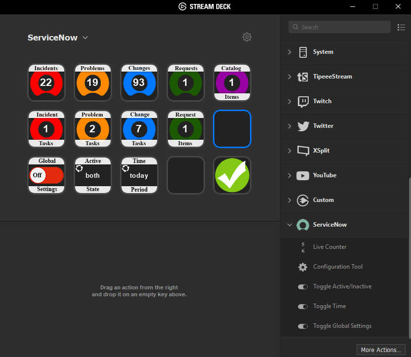

# Stream Deck ServiceNow Plugin
## Preview

## Features
- Track all major ticket types from your ServiceNow instance
- Individually configurable counters (Ticket Type / Active State / Time Period)
- Global Settings override for fast alternate views (Toggle On to apply global settings to all counters, Toggle Off to revert counters to individually configured state)
- One time, reusable instance configuration action to apply settings to all buttons/actions
## Requirements
- A Stream Deck by Elgato is required to use this plugin
- The JSONP Wrapper included in this repository is required to be installed on your instance for this plugin to work
### JSONP Wrapper Installation
1. In your ServiceNow instance, create a new UI Page with the name **jsonp**
2. In the **HTML** field of the UI Page, paste the contents of the file **jsonp** (included in this repository)
3. In the application navigator filter of your instance, type **sys_public.list**
4. Click **New**
5. In the **sys_public** table, create a record with the following values
   - **Page** : jsonp 
   - **Active** : Ticked / Checked

Instructions on how to make a page public in your instance can also be found at [Making a Page Public](http://wiki.servicenow.com/index.php?title=Making_a_Page_Public)

# JSONP Wrapper
This is useful for applications that want to make JSONP requests to ServiceNow from client side.

> I did not create this JSONP Wrapper, I sourced it off a ServiceNow community page, however I have lost the reference, will include if and when I find it again.
